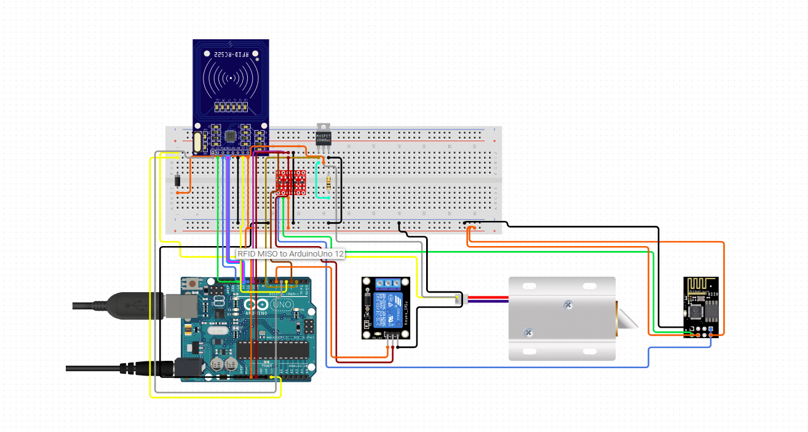

# UPT - Smart university accommodation room

## Description

### Door lock
**_Modules_**
 - **ESP8266**: Module responsible with database communication. The module communicates with the Arduino board via serial communication in order to check if any person tried to unlock the door and sends the data to the Firebase Realtime Database. This data can be accessed from the Android application.
 - **RFID Sensor**: Module responsible with access card reading. If the card's uid is registered, the user may come in, otherwise the door will not be unlocked.
 - **5v Relay**: Used to power the door lock. It is triggered by Arduino board.
 - **Door lock**: 12VDC Solenoid door lock
 
 ### Lights
 **_Modules_**
  - **ESP8266**: Module responsible with database communication. It queries the realtime database from Firebase in order to check if a client has changed the state of the lights and if it is changed it transmits to the Arduino board the change and Arduino will switch the lights as the client desires.
  - **5v Relay**: Used to power the ligths. Triggered by Arduino board.
  - **Lights**: LED bar.

### Sensors
**_Modules_**
  - **DHT22**: The DHT22 is a basic, low-cost digital temperature and humidity sensor. It uses a capacitive humidity sensor and a thermistor to measure the surrounding air, and spits out a digital signal on the data pin (no analog input pins needed). It's fairly simple to use, but requires careful timing to grab data.
 	Power supply pins(VDD GND)
 AM2302 supply voltage range 3.3V - 5.5V, recommended supply voltage is 5V.
	Serial data(SDA)
SDA pin is tri structure for reading, writing sensor data. Specific communication timing, see the detailed description of the communication protocol.

  - **MQ2**: is one of the commonly used gas sensors in MQ sensor series.
	When tin dioxide (semiconductor particles) is 
heated in air at high temperature, oxygen is adsorbed 
on the surface. In clean air, donor electrons in tin
dioxide are attracted toward oxygen which is adsorbed
on the surface of the sensing material. This prevents
electric current flow.
	The analog output voltage provided by the sensor
changes in proportional to the concentration of smoke/
gas. The greater the gas concentration, the higher is
the output voltage; while lesser gas concentration 
results in low output voltage. The following 
animation illustrates the relationship between gas
concentration and output voltage.

## Block diagram

## Schematics

### Door lock

### Sensors

### Lights

