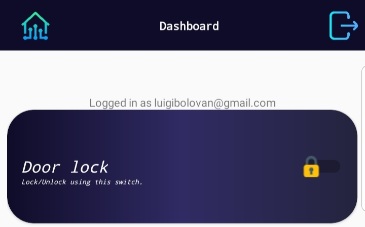

# Brief description of the door lock subsystem

The door lock is triggered either by a **_[RFID card reader](./lock-rfid.ino)_** or an **_[Android app](../app/app)_**.

## RFID card reader

When a card with a known UID meets the RFID sensor, Arduino triggers the 5v relay that unlocks the 12v solenoid door lock.

Arduino connection:
| RFID card reader PIN | Arduino PIN |
|:--------------------:|:-----------:|
|SDA                   | PIN 10      |
|SCK                   | PIN 13      |
|MOSI                  | PIN 11      |
|MISO                  | PIN 12      |
|GND                   | GND         |
|RST                   | PIN 9       |
|3v3                   | 3v3         |

## Android app

The Android app is connected to a Firebase Realtime Database that stores information about the door lock status(unlocked or locked) and changes this status using a switch.
On the other side, an [ESP8266 module](./esp8266.ino) is connected both to Arduino(using the [SoftwareSerial library](./lock-app.ino)), in order to trigger the 12v solenoid door lock, and Firebase to query the database for changes about the status of the lock.

#### The door lock switch

ESP8266 connection:
| ESP8266 PIN | Arduino PIN     |
|:-----------:|:-----------:    |
|GND          |GND              |
|3v3          |3v3              |
|EN           |3v3              |
|TX           |SoftwareSerialRX |
|RX           |SoftwareSerialTX |
|RST*         |GND              |
|GPIO0*       |GND              |

*_only in programming mode_
